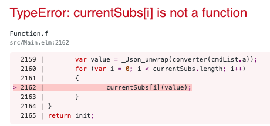

# Elm 0.19 ports issue

This project is bootstrapped with [Create Elm App](https://github.com/halfzebra/create-elm-app). It serves as a reproducible example for issue [#350](https://github.com/halfzebra/create-elm-app/issues/350) of [halfzebra/create-elm-app](https://github.com/halfzebra/create-elm-app).

On startup, it attempts to send a datastructure from Elm to JavaScript using ports. 

* `src/index.js` instantiates the Elm app and registreres a JavaScript handler to the expected port
* `src/Main.elm` issues the `Cmd` to send the datastructure in its `init` function. 
* `src/dataHandler.js` is called if data is received from Elm. The handler outputs the data to the browser console.

Run the project with `elm-app start`. 

__Observed behavior__: The received data is not printed to the console as expected. Instead, the browser produces the following error message:

